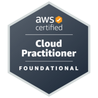
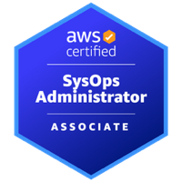
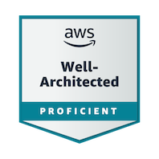
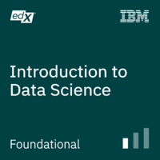
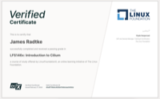
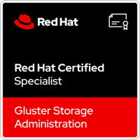
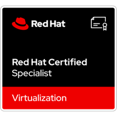
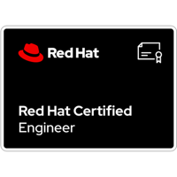

- 👋 Hi, I’m @cloudXabide (James Radtke)
- I have been doing "system administration" since 1999.  Got my first RHCE in 2000.  Worked at Sun Microsystems (until Oracle bought them), the worked at Red Hat (until IBM bought them), worked at AWS (then things changed), and now work at [SUSE](https://www.suse.com/)
- 👀 I’m interested in ... Hybrid and Edge Cloud, SUSE (Linux, AI, Virtualization, Observability, Securtiy), AWS Cloud, Containers, Docker, Kubernetes, KubeCon/CNCF, Digital Sovereignty
- My primary interest for personal development is Kubernetes &#9096; - which I am documenting via my Git Repo(s) and https://kubernerdes.com
- 🌱 I’m currently focused on (and contributing to) ... 
  - [ExMachina](https://github.com/cloudxabide/ExMachina) - Homelab "playground" for "A sovereign, air-gap-capable agentic AI platform with physical edge presence"
  - [luminAIge](https://github.com/cloudxabide/luminAIge) - Homelab "playground" for "Sovereign AI infrastructure that is RAG-enabled, running entirely on local hardware."
  - [RGS Carbide Enclave](https://github.com/jradtke-rgs/carbide-enclave.kubernerdes.com) - Deploy RGS solutions in a tactical edge form factor
  - and maybe the Banjo and Bass
- 💞️ I’m looking to collaborate on ... "how-to content", podcasts, etc...
- 📫 How to reach me ... cloudxabide \<at> gmail

- My cloudXabide Git Repo is a collection of stuff I use personally.  My HomeLab, interests (NVIDIA), etc..
- What this Repo is not: a training program or curriculum.   There are many other folks already doing a great job at that.

| Service - Username     | URL                                      |
|:-----------------------|:-----------------------------------------|
| GitHub - cloudXabide   | https://github.com/cloudxabide       | 
| Medium - @cloudxabide  | https://medium.com/@cloudxabide/     |
| Credly - cloudxabide   | https://credly.com/users/cloudxabide |
| YouTube - @cloudxabide | https://www.youtube.com/channel/UCA7P2NZMN_FW6SvXwn2sz-A |

 

 

 

## Certifications (Expired/Old)

# Best Practices and suggestions
* Do NOT use the "Root Account" for anything other than creating new IAM accounts, or managing IdentityCenter assets.
* Use MFA.  Always. (where possible)
* Create and use a ["tagging strategy"](https://docs.aws.amazon.com/general/latest/gr/aws_tagging.html) of some sort.
* (NEW) Identity Center is tremendous and quite powerful.  I recommend using it.

 

<!---
cloudXabide/cloudXabide is a ✨ special ✨ repository because its `README.md` (this file) appears on your GitHub profile.
You can click the Preview link to take a look at your changes.
--->
