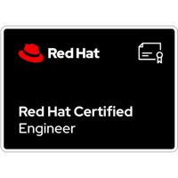

- 👋 Hi, I’m @cloudXabide (James Radtke)
- 👀 I’m interested in ... Hybrid Cloud, AWS Cloud, EKS Anywhere, Containers, Docker, Kubernetes, Linux, AI/ML - GenerativeAI, KubeCon/CNCF
- My primary interest for personal development is Kubernetes &#9096; - which I am documenting via my Git Repo(s) and https://kubernerdes.com
- 🌱 I’m currently learning (and contributing to) ... 
  - [Amazon EKS-Anywhere](https://github.com/aws/eks-anywhere) - Run Amazon EKS **Anywhere** 
  - [Amazon EKS Workshop](https://github.com/aws-samples/eks-workshop-v2 ) - Learn EKS with currated guides and examples
  - [Ollama](https://github.com/jmorganca/ollama) - An LLM "engine" (?) for running different models
  - [Ollama-webui](https://github.com/ollama-webui/ollama-webui) - a WebUI to provide access to Ollama
  - [Data On EKS](https://github.com/awslabs/data-on-eks) - Build, Scale, and Optimize Data & AI/ML Platforms on Amazon EKS 🚀
  - and maybe the Banjo and Bass
- 💞️ I’m looking to collaborate on ... "how-to content", podcasts, etc...
- 📫 How to reach me ... cloudxabide \<at> gmail

- My cloudXabide Git Repo is a collection of stuff I use personally.  My HomeLab, interests (NVIDIA), etc..
- What this Repo is not: a training program or curriculum.   There are many other folks already doing a great job at that.

| Service - Username     | URL                                      |
|:-----------------------|:-----------------------------------------|
| GitHub - cloudXabide   | https://github.com/cloudxabide       | 
| Medium - @cloudxabide  | https://medium.com/@cloudxabide/     |
| Credly - cloudxabide   | https://credly.com/users/cloudxabide |

 

 

 

## Certifications (Expired/Old)

# Best Practices and suggestions
* Do NOT use the "Root Account" for anything other than creating new IAM accounts, or managing IdentityCenter assets.
* Use MFA.  Always. (where possible)
* Create and use a ["tagging strategy"](https://docs.aws.amazon.com/general/latest/gr/aws_tagging.html) of some sort.
* (NEW) Identity Center is tremendous and quite powerful.  I recommend using it.

 

<!---
cloudXabide/cloudXabide is a ✨ special ✨ repository because its `README.md` (this file) appears on your GitHub profile.
You can click the Preview link to take a look at your changes.
--->
